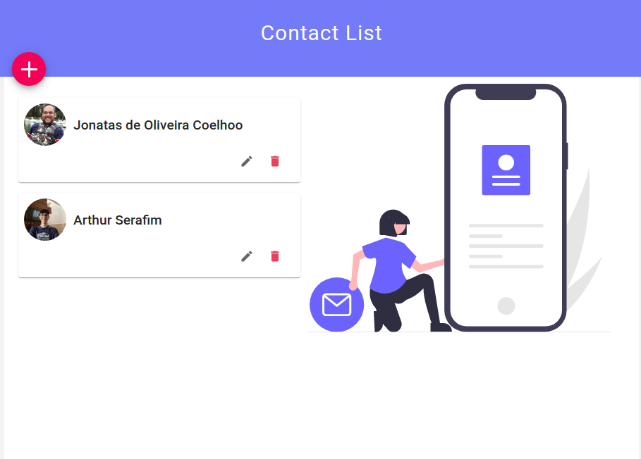
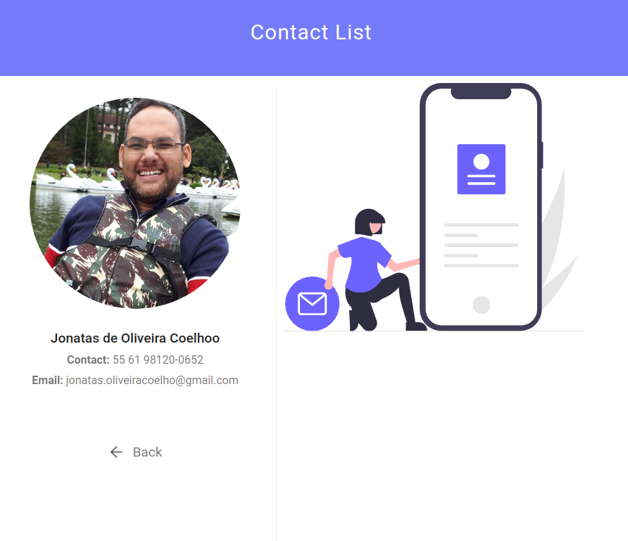
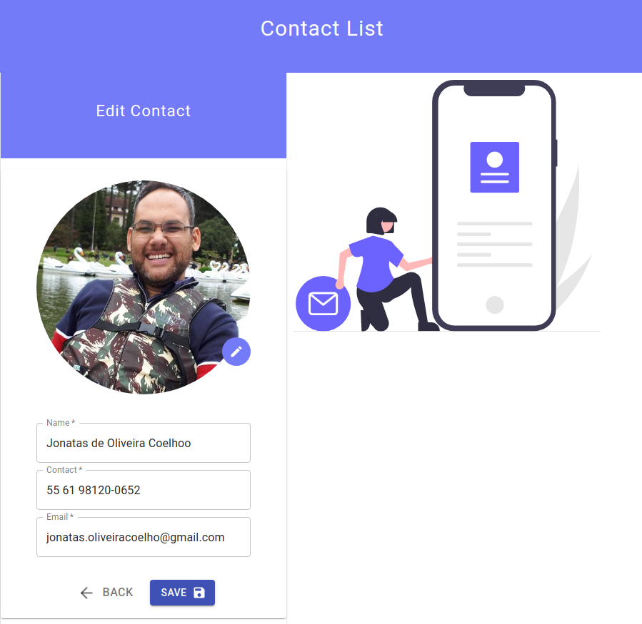
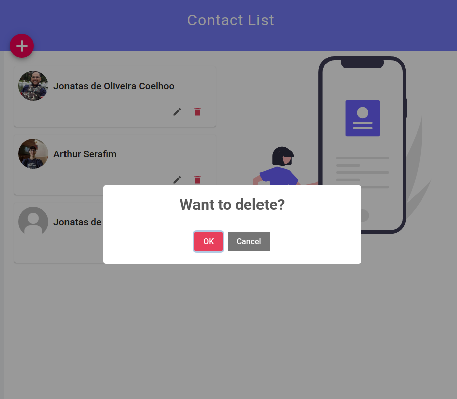
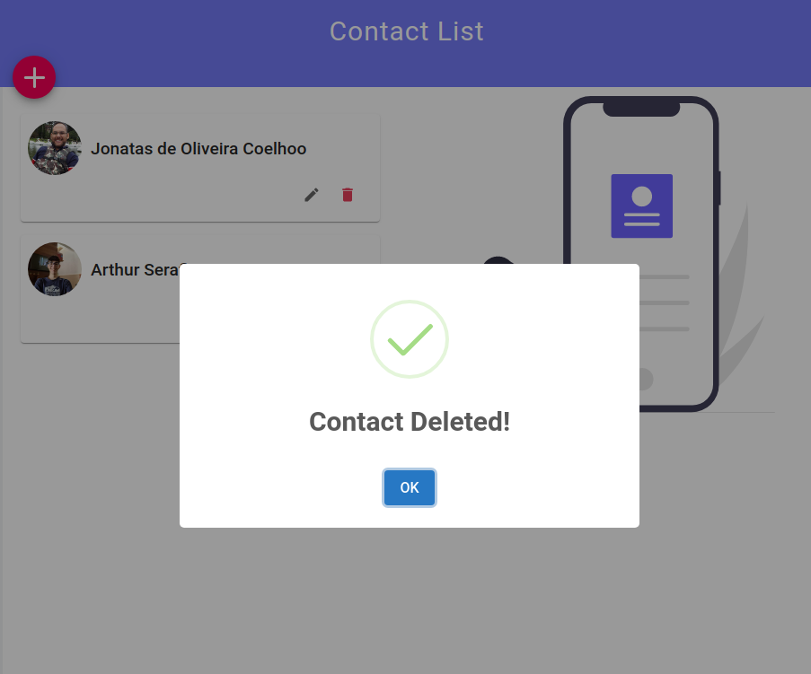

<h3 align="center">
   Contact List:
</h3>

   See the project on production:
   <a href="https://nlw-moveit-two.vercel.app/" rel="noopener noreferrer" target='_blank'>https://jonatasoc-contact-list.netlify.app/</a>

---

   

   

   

   

   

---

# :pushpin: Table of Contents

- [About](#information_source-about)
- [Features](#rocket-features)
- [Technologies](#star-technologies)
- [Installation](#construction_worker-installation)
- [Getting Started](#runner-getting-started)
- [FAQ](#postbox-faq)
- [License](#closed_book-license)

 

# :information_source: About

A simple contact list using localStorage to store users data.

# :rocket: Features

- List contacts
- Edit contact
- See contact details
- Delete contact
- Save user data and photo on localStorage

# :star: Technologies

| Frontend                                                           |
| ---------------------------------------------------------          |
| [Typescript](https://www.typescriptlang.org/)                      |
| [React](https://reactjs.org/)                                      |
| [React Hooks](https://reactjs.org/)                                |
| [React Router DOM](https://reactrouter.com/web/guides/quick-start) |
| [Context API](https://reactjs.org/)                                |
| [styled-components](https://styled-components.com/)                |
| [Material-UI](https://material-ui.com/)                            |
| [react-icons](https://react-icons.github.io/react-icons/)          |
| [SweetAlert2](https://sweetalert2.github.io/recipe-gallery/)       |
|                                                                    |
|                                                                    |

# :construction_worker: Installation

**You need to install [Node.js](https://nodejs.org/en/download/) and [Yarn](https://yarnpkg.com/) first, then in order to clone the project via HTTPS, run this command:**

`git clone https://github.com/jonatasoc/contact-list.git`

SSH URLs provide access to a Git repository via SSH, a secure protocol. If you have a SSH key registered in your Github account, clone the project using this command:

`git@github.com:jonatasoc/contact-list.git`

**Install dependencies**

`yarn`

# :runner: Getting Started

After that, run the following command in order to start the application in a development environment:

`yarn start`

# :closed_book: License

Released in 2021
This project is under the MIT license
